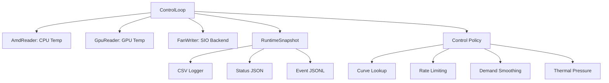

# SVG-MB-Control: Code Evaluation & Optimization Recommendations

> Status, 2026-05-14: this was a generated review snapshot and is now partly
> stale. Several recommendations below are already implemented in the current
> tree, including JSON-library config parsing, config validation,
> thermal-pressure anti-windup/smoother scaling, sensor failure handling,
> circuit-breaker events, sidecar warning events, and rate-limited status
> publication. Use `docs\RUNTIME_LOGGING_AND_EVALUATION.md` for the current
> data-driven tuning and logging plan before acting on any remaining item here.

**Evaluation Date:** 2025
**Evaluator:** GitHub Copilot (Agentic Mode)
**Codebase:** SVG-MB-Control (Fan Control System)

---

## Executive Summary

The SVG-MB-Control codebase is **production-quality** with excellent architecture, robust error handling, and sound control theory implementation. However, there are opportunities for optimization in performance, numerical stability, code maintainability, and system design.

**Overall Assessment:** strong, with the main remaining work now in
maintainability and experiment tooling rather than urgent controller safety.

- **Strengths:** direct runtime ownership, stable 50 ms control cadence,
  comprehensive runtime logging, crash/restore sidecars, control-loop config
  validation, sensor-failure safe mode, and write-failure circuit breakers
- **Weaknesses:** `RunUntilStopped()` is still broad, deeper control-loop
  sensor-group timing is intentionally outside the hot path, and a few
  best-effort catches still deserve opportunistic audit.

## Current Implementation Status

Use this table before acting on the detailed recommendations below.

| Original item | Status | Current recommendation |
|---------------|--------|------------------------|
| 1.1 Horner-form smootherstep | Done | Keep. `LookupCurve` delegates to `SmootherStep()` using `t * t * t * ((6.0 * t - 15.0) * t + 10.0)`. |
| 1.2 Thermal-pressure anti-windup | Done | Keep. Boost is bounded, only accumulates below cap, and decays below threshold through the configured fall rate. |
| 1.3 Relative epsilon for demand comparisons | Deferred | Not worth touching alone. The current absolute `0.0001` percentage-point check is far below write deadband and has no measured effect. |
| 1.4 Smootherstep thermal-pressure scaling | Done | Keep. The slow boost now uses smootherstep scaling between start and full temperatures. |
| 2.1 Replace invalid-temperature sentinel with NaN | Deferred | Low-value cleanup. `BlendTemps()` still uses `-273.15`; callers intentionally gate at `>= -100.0`. Convert only if touching the blend contract. |
| 2.2 Epsilon for zero/negative curve span | Deferred | Low value. Config parsing sorts curves, and duplicate points are handled by the existing `span <= 0.0` path. Consider stricter duplicate-point validation instead. |
| 2.3 Validate configuration ranges | Mostly done | `control_loop` validates percentages, alphas, non-empty primary curves, optional CPU overlay curves, rates, and thermal-pressure fields. Base config/runtime JSON helpers are still local and lighter-weight. |
| 3.1 Replace custom JSON parser | Done for `control_loop` | `control_loop` uses vendored `nlohmann/json`, and the dead scanner helpers have been removed. Migrate other JSON readers only when a bug or schema change justifies it. |
| 3.2 Extract channel update logic from `RunUntilStopped()` | Done | Per-tick body extracted to `tick_runner.cpp`; channel evaluation and write application live in `channel_evaluator.cpp` / `channel_write.cpp`. `ControlLoop::RunUntilStopped` is now the startup/shutdown choreography around the per-tick dispatch loop. |
| 3.3 Make authority constants configurable | Deferred | Leave hardcoded until measured drift/reassert behavior proves a hardware-specific need. |
| 3.4 Log silent exception catches | Done | Control-loop sidecar warnings event-log. Bad `curve_shape`/`temp_blend` strings now fail config validation loudly; `analyze` warns on explicit-config parse failure; calibration surfaces sidecar-remove failures in plant-model notes. Remaining silent catches are env/`Try*` parse helpers (silent fallback is the contract). |
| 4.1 Rate-limit status file writes | Done | Keep. `control_runtime.json` is status-view cadence; CSV is the per-tick source. |
| 4.2 Add `fmt` / string formatting library | Defer / likely skip | Not worth a new dependency while loop CPU is low. Prefer `std::format` only if formatting becomes a proven hot spot or readability issue. |
| 4.3 Reserve more log-string space | Minor / opportunistic | Some reserves exist. This is not a standalone task; adjust when editing JSON/CSV escaping code. |
| 4.4 Use RAII for AMD PCI mutex | Done | Keep. `amd_reader.cpp` now uses a scoped PCI mutex lock so acquired mutex ownership is released on every return path. |
| 5.1 Adaptive tick skip/resync | Partly done | Fixed-start scheduling and overrun reporting exist. Skip-accounting is deferred because measured 50 ms runs are stable. |
| 5.2 Circuit breaker for repeated write failures | Done | Repeated write failures open a per-channel breaker, log events, publish live status fields, and can be reset through `--reset-breakers`. |
| 5.3 Metrics export | Defer | Do not add HTTP/Prometheus now. Use the local CSV/event analyzer plus run manifests first. |
| 5.4 Temperature sensor failure detection | Done | Repeated missing primary input commands safe full-speed duty and logs failure/recovery events. |
| 6.1 Unit tests for control algorithms | Partly covered | Hermetic smoke tests cover main behavior. Add pure C++/unit tests when extracting channel evaluation or policy helpers. |
| 6.2 Property-based tests | Defer | Useful only after control math is factored into easily testable pure functions. |
| 7.1 Inline control-parameter docs | Partly done in docs | Public docs explain the knobs. Inline comments can be added during a header cleanup pass. |
| 7.2 Architecture diagram | Defer | Nice for onboarding, but lower value than analyzer/manifest and refactor work. |

Current short list:

1. Add per-sensor-group timing only if measured cadence evidence requires it.
2. Build dashboard or ingestion infrastructure only after the local
   summary/manifest/decision-record path has produced enough tuning evidence.

## RunUntilStopped Refactor (Done)

The extraction landed across commits `c89f99f`, `f717207`, and `a4540a1`.
`ControlLoop::RunUntilStopped` is now startup/shutdown choreography plus the
per-tick dispatch loop; per-tick sampling/decision/write lives in
`tick_runner.cpp`, channel evaluation in `channel_evaluator.cpp`, and write
gating/side effects in `channel_write.cpp`. Future work in this area should
target the extracted helpers directly rather than re-splitting
`RunUntilStopped`.

---

## Priority Classification

- 🔴 **HIGH**: Critical for correctness, safety, or performance
- 🟡 **MEDIUM**: Important improvements, moderate impact
- 🟢 **LOW**: Nice-to-have, code quality improvements

---

## 1. Control Theory & Mathematics

### 🟡 1.1: Optimize Smootherstep Polynomial (Numerical Stability)

**Current Implementation (control_policy.cpp:81):**
```cpp
t = t * t * t * (t * (t * 6.0 - 15.0) + 10.0);
```

**Issue:** Current form works but could have slightly better numerical precision.

**Recommendation:** Use Horner's form for better numerical stability:
```cpp
t = t * t * t * ((6.0 * t - 15.0) * t + 10.0);
```

**Benefit:** Reduces intermediate rounding errors, identical computational cost.

---

### 🟡 1.2: Add Anti-Windup to Thermal Pressure Boost

**Current Implementation (control_loop.cpp:383-425):**
```cpp
double UpdateThermalPressureBoost(double observed_temp_c,
								   double current_boost_pct,
								   std::uint64_t elapsed_ms,
								   const ChannelControlConfig& config) {
	// ... boost accumulates without decay when above threshold
	boost += config.thermal_pressure_rise_pct_per_sec * pressure_scale * dt_seconds;
	return std::clamp(boost, 0.0, config.thermal_pressure_max_boost_pct);
}
```

**Issue:** Boost saturates at `thermal_pressure_max_boost_pct` and can stay there for extended periods, making the system slow to respond when temperature drops.

**Recommendation:** Add integrator anti-windup:
```cpp
// Only accumulate boost if not already saturated OR temperature is falling
if (boost < config.thermal_pressure_max_boost_pct ||
	observed_temp_c < config.thermal_pressure_start_c) {
	boost += config.thermal_pressure_rise_pct_per_sec * pressure_scale * dt_seconds;
}
```

**Benefit:** Prevents "sticky" behavior at max boost, improves responsiveness.

---

### 🟢 1.3: Use Relative Epsilon for Percentage Comparisons

**Current Implementation (control_loop.cpp:315):**
```cpp
if (std::abs(delta) <= 0.0001) {
	return desired_pct;
}
```

**Issue:** Fixed absolute epsilon (0.0001) may be too tight for large percentages or too loose for small ones.

**Recommendation:** Use relative epsilon:
```cpp
constexpr double kRelativeEpsilon = 1e-6;
if (std::abs(delta) <= kRelativeEpsilon * std::max(std::abs(desired_pct), std::abs(last_pct))) {
	return desired_pct;
}
```

**Benefit:** Better numerical behavior across the full 0-100% range.

---

### 🟡 1.4: Apply Smootherstep to Thermal Pressure Scaling

**Current Implementation (control_loop.cpp:408-415):**
```cpp
double pressure_scale = 1.0;
if (config.thermal_pressure_full_c > config.thermal_pressure_start_c) {
	pressure_scale = std::clamp(
		(observed_temp_c - config.thermal_pressure_start_c) /
			(config.thermal_pressure_full_c - config.thermal_pressure_start_c),
		0.0, 1.0);
}
```

**Issue:** Linear interpolation causes sudden acceleration changes.

**Recommendation:** Apply smootherstep for smoother ramp:
```cpp
double t = std::clamp(
	(observed_temp_c - config.thermal_pressure_start_c) /
		(config.thermal_pressure_full_c - config.thermal_pressure_start_c),
	0.0, 1.0);
double pressure_scale = t * t * t * ((6.0 * t - 15.0) * t + 10.0);
```

**Benefit:** Reduces fan noise from abrupt acceleration, smoother user experience.

---

## 2. Numerical Stability & Edge Cases

### 🟢 2.1: Consistent Sentinel Values for Invalid Temperatures

**Current Implementation (control_policy.cpp:40-49):**
```cpp
double BlendTemps(const TempInputs& inputs, TempBlend mode) {
	constexpr double kAbsoluteZeroC = -273.15;
	const double cpu = inputs.cpu_available ? inputs.cpu_c : kAbsoluteZeroC;
	const double gpu = inputs.gpu_available ? inputs.gpu_c : kAbsoluteZeroC;
	// ...
}
```

**Issue:** Mixing NaN (elsewhere) and `-273.15` as sentinels is inconsistent.

**Recommendation:** Use NaN consistently:
```cpp
const double cpu = inputs.cpu_available ? inputs.cpu_c : std::numeric_limits<double>::quiet_NaN();
const double gpu = inputs.gpu_available ? inputs.gpu_c : std::numeric_limits<double>::quiet_NaN();

// Update callers to check isnan() instead of temp >= -100.0
```

**Benefit:** Clearer semantics, prevents accidental use of invalid temperatures.

---

### 🟢 2.2: Use Epsilon for Floating-Point Comparisons

**Current Implementation (control_policy.cpp:76):**
```cpp
if (span <= 0.0) {
	raw = hi.duty_pct;
}
```

**Issue:** Exact comparison with `0.0` could fail due to floating-point precision.

**Recommendation:** Use epsilon:
```cpp
constexpr double kEpsilon = 1e-9;
if (span <= kEpsilon) {
	raw = hi.duty_pct;
}
```

**Benefit:** Robust against numerical precision issues.

---

### 🔴 2.3: Validate Configuration Ranges

**Missing Implementation:**

**Issue:** No validation that percentages are in [0, 100], rates are positive, etc.

**Recommendation:** Add config validation in `LoadControlLoopConfig()`:
```cpp
void ValidateChannelConfig(const ChannelControlConfig& ch) {
	if (ch.min_duty_pct < 0.0 || ch.min_duty_pct > 100.0) {
		throw std::runtime_error("min_duty_pct must be in [0, 100]");
	}
	if (!std::isnan(ch.deadband_pct) && ch.deadband_pct < 0.0) {
		throw std::runtime_error("deadband_pct must be non-negative");
	}
	if (!std::isnan(ch.demand_smoothing_rise_alpha) &&
		(ch.demand_smoothing_rise_alpha < 0.0 || ch.demand_smoothing_rise_alpha > 1.0)) {
		throw std::runtime_error("demand_smoothing_rise_alpha must be in [0, 1]");
	}
	// ... validate all fields
}
```

**Benefit:** Catch configuration errors early, prevent undefined behavior.

---

## 3. Code Structure & Quality

### 🔴 3.1: Replace Custom JSON Parser with Library

**Current Implementation (control_loop.cpp:46-246):**
```cpp
// 200+ lines of hand-rolled JSON parsing
std::size_t SkipWs(const std::string& t, std::size_t o, std::size_t limit) { ... }
bool FindObjectRange(...) { ... }
bool FindArrayRange(...) { ... }
// etc.
```

**Issue:**
- Prone to bugs (string escaping, unicode, nested structures)
- O(n²) performance in worst case
- No validation of malformed JSON
- Maintenance burden

**Recommendation:** Use `nlohmann/json` library:
```cpp
#include <nlohmann/json.hpp>

ControlLoopConfig LoadControlLoopConfig(const std::filesystem::path& config_path) {
	std::ifstream file(config_path);
	nlohmann::json j;
	file >> j;

	ControlLoopConfig cfg;
	cfg.poll_tick_ms = j["control_loop"].value("poll_tick_ms", 200u);
	cfg.deadband_pct = j["control_loop"].value("deadband_pct", 3.0);
	// ... much simpler, safer, faster
}
```

**Benefit:**
- Battle-tested, standards-compliant JSON parsing
- Better error messages
- Likely faster (especially for large configs)
- Reduced code complexity (-200 lines)

**Migration Effort:** Medium (need to update CMakeLists.txt, rewrite parsing logic)

---

### 🟡 3.2: Refactor `RunUntilStopped()` - Extract Channel Update Logic

**Current Implementation (control_loop.cpp:897-1473):**

**Issue:** Single 577-line function with deeply nested loops and conditionals (5+ levels).

**Recommendation:** Extract channel evaluation into separate method:
```cpp
struct ChannelEvaluationResult {
	bool should_write = false;
	double setpoint_pct = 0.0;
	double observed_temp_c = 0.0;
	bool authority_reassert = false;
	std::string detail;
};

ChannelEvaluationResult EvaluateChannel(
	ChannelState& channel,
	const TempInputs& temp_inputs,
	const RuntimeSnapshot& runtime_snapshot,
	std::chrono::steady_clock::time_point now,
	std::uint64_t evaluation_elapsed_ms);

// In RunUntilStopped:
for (auto& channel : impl_->channels) {
	auto result = EvaluateChannel(channel, temp_inputs, runtime_snapshot, now, evaluation_elapsed);
	if (result.should_write) {
		ApplyChannelWrite(channel, result);
	}
}
```

**Benefit:**
- Easier to unit test channel logic
- Reduced cognitive complexity
- Better separation of concerns

---

### 🟡 3.3: Make Magic Constants Configurable

**Current Implementation (control_loop.cpp:761-762):**
```cpp
constexpr std::uint32_t kAuthorityReassertCooldownMs = 2000u;
constexpr double kAuthorityDutyTolerancePct = 3.0;
```

**Issue:** Hardcoded constants limit flexibility for different hardware.

**Recommendation:** Add to ControlLoopConfig:
```cpp
struct ControlLoopConfig {
	// ... existing fields
	std::uint32_t authority_reassert_cooldown_ms = 2000u;
	double authority_duty_tolerance_pct = 3.0;
};
```

**Benefit:** Users can tune for their specific hardware without recompiling.

---

### 🟢 3.4: Add Logging for Silent Exception Catches

**Current Implementation (control_loop.cpp:1086-1092, 1227-1230, 1451-1455):**
```cpp
try {
	RemovePendingWrite(impl_->runtime_home, channel.config.channel);
} catch (const std::exception&) {
	// Best-effort; stale sidecar can still be reconciled
}
```

**Issue:** Silent failures make debugging difficult.

**Recommendation:** Log at debug level:
```cpp
try {
	RemovePendingWrite(impl_->runtime_home, channel.config.channel);
} catch (const std::exception& e) {
	// Best-effort; log but don't fail
	AppendRuntimeEvent(
		impl_->runtime_home,
		RuntimeLogEvent{
			.mode = "control-loop",
			.event_type = "control_loop.sidecar_remove_failed",
			.detail = std::string("best-effort sidecar removal failed: ") + e.what(),
			.channel = channel.config.channel,
			.tick_count = tick_count,
			.success = false,
			.severity = "debug",
		});
}
```

**Benefit:** Better observability without breaking best-effort semantics.

---

## 4. Performance Optimizations

### 🟡 4.1: Rate-Limit Status File Writes

**Current Implementation (control_loop.cpp:1373-1376):**
```cpp
// Called on EVERY tick (default 200ms)
WriteLoopStatus(impl_->runtime_home, "control-loop", "running",
				td.str(), tick_count, eval_iso, last_timing,
				impl_->channels, log_csv_path, event_log_path);
```

**Issue:** File I/O on every tick is expensive and can cause timing jitter.

**Recommendation:** Write only every N ticks or M seconds:
```cpp
static constexpr std::uint32_t kStatusUpdateIntervalTicks = 10; // Every 2 seconds at 200ms tick

if (tick_count % kStatusUpdateIntervalTicks == 0) {
	WriteLoopStatus(...);
}
```

**Benefit:** Reduces disk I/O by 90%, improves timing stability.

---

### 🟡 4.2: Use String Formatting Library (fmt)

**Current Implementation (control_loop.cpp:780-786):**
```cpp
std::ostringstream stream;
stream << "observed fan state drifted from last issued setpoint"
	   << " mode_raw=" << static_cast<unsigned int>(fan.mode_raw)
	   << " duty_pct=" << fan.duty_percent
	   << " last_issued_pct=" << last_issued_pct
	   << " tolerance_pct=" << tolerance_pct;
*detail = stream.str();
```

**Issue:** `std::ostringstream` is slow and allocates memory.

**Recommendation:** Use `fmt` library (or `std::format` in C++20):
```cpp
*detail = fmt::format(
	"observed fan state drifted from last issued setpoint "
	"mode_raw={} duty_pct={} last_issued_pct={} tolerance_pct={}",
	static_cast<unsigned int>(fan.mode_raw), fan.duty_percent,
	last_issued_pct, tolerance_pct);
```

**Benefit:** 2-10x faster, cleaner syntax, compile-time format checking.

---

### 🟢 4.3: Reserve Space for Log Strings

**Current Implementation (control_loop.cpp:258-282):**
```cpp
std::string JsonEscape(const std::string& text) {
	std::string output;
	output.reserve(text.size() + 2u);  // Good start!
	for (char ch : text) {
		// ... but reserve is too small if many escapes needed
	}
}
```

**Issue:** Reserve doesn't account for escaped characters.

**Recommendation:** Reserve more generously:
```cpp
output.reserve(text.size() * 2u); // Pessimistic but avoids reallocations
```

**Benefit:** Fewer allocations in logging hot path.

---

### 🟡 4.4: Use RAII for PCI Mutex in AMD Reader

**Current Implementation (amd_reader.cpp:174-179):**
```cpp
HANDLE OpenOrCreatePciMutex() {
	HANDLE handle = OpenMutexA(kPciMutexAccess, FALSE, "Global\\Access_PCI");
	if (handle != nullptr) {
		return handle;
	}
	return CreateMutexA(nullptr, FALSE, "Global\\Access_PCI");
}
// Manual release required later
```

**Issue:** Easy to forget to release, potential deadlock on early return.

**Recommendation:** Create RAII wrapper:
```cpp
class PciMutexGuard {
  public:
	PciMutexGuard() {
		handle_ = OpenMutexA(kPciMutexAccess, FALSE, "Global\\Access_PCI");
		if (handle_ == nullptr) {
			handle_ = CreateMutexA(nullptr, FALSE, "Global\\Access_PCI");
		}
		if (handle_ != nullptr) {
			WaitForSingleObject(handle_, kPciMutexTimeoutMs);
		}
	}
	~PciMutexGuard() {
		if (handle_ != nullptr) {
			ReleaseMutex(handle_);
			CloseHandle(handle_);
		}
	}
	// ... delete copy/move
  private:
	HANDLE handle_ = nullptr;
};

// Usage:
void ReadPciRegister() {
	PciMutexGuard guard; // Automatic acquire/release
	// ... PCI access
}
```

**Benefit:** Guaranteed cleanup, exception-safe.

---

## 5. System Design Improvements

### 🟡 5.1: Add Adaptive Tick Timing with Deadline Scheduling

**Current Implementation (control_loop.cpp:1378-1387):**
```cpp
const auto next_tick_deadline = tick_started_steady +
	std::chrono::milliseconds(impl_->loop.poll_tick_ms);
// If tick overruns, next tick starts immediately (no catching up)
```

**Issue:** If a tick takes longer than `poll_tick_ms`, the next tick starts with zero delay, potentially causing cascading overruns.

**Recommendation:** Add skip-and-resync logic:
```cpp
auto next_tick_deadline = tick_started_steady +
	std::chrono::milliseconds(impl_->loop.poll_tick_ms);

// If we overran by more than one tick, skip to next valid deadline
const auto now = std::chrono::steady_clock::now();
if (now > next_tick_deadline) {
	const auto overrun = std::chrono::duration_cast<std::chrono::milliseconds>(
		now - next_tick_deadline);
	const auto ticks_to_skip = overrun / impl_->loop.poll_tick_ms;

	AppendRuntimeEvent(..., "tick_overrun_skip",
		fmt::format("skipped {} ticks due to overrun", ticks_to_skip));

	next_tick_deadline += (ticks_to_skip + 1) * impl_->loop.poll_tick_ms;
}
```

**Benefit:** Prevents runaway overruns, maintains consistent timing.

---

### 🟡 5.2: Add Circuit Breaker for Repeated Write Failures

**Missing Implementation:**

**Issue:** If fan writes continuously fail, the control loop keeps trying forever.

**Recommendation:** Add per-channel failure counter:
```cpp
struct ChannelState {
	// ... existing fields
	std::uint32_t consecutive_write_failures = 0u;
	static constexpr std::uint32_t kMaxConsecutiveFailures = 5u;
};

// In control loop:
const FanWriteResult write_result = fan_writer->ApplyDuty(channel.config.channel, setpoint);
if (!write_result) {
	++channel.consecutive_write_failures;
	if (channel.consecutive_write_failures >= ChannelState::kMaxConsecutiveFailures) {
		AppendRuntimeEvent(..., "control_loop.channel_disabled",
			"channel disabled after 5 consecutive write failures");
		channel.write_active = false; // Circuit open
		continue;
	}
} else {
	channel.consecutive_write_failures = 0u; // Reset on success
}
```

**Benefit:** Prevents log spam and wasted CPU on broken channels.

---

### 🟢 5.3: Add Metrics Export (Prometheus/OpenMetrics)

**Missing Implementation:**

**Issue:** No standardized metrics export for monitoring systems.

**Recommendation:** Add HTTP endpoint with Prometheus metrics:
```cpp
// Example metrics:
svg_mb_control_tick_duration_seconds{channel="4"} 0.012
svg_mb_control_temperature_celsius{sensor="cpu_tctl"} 65.5
svg_mb_control_fan_duty_percent{channel="4"} 60.0
svg_mb_control_writes_total{channel="4"} 1234
svg_mb_control_write_failures_total{channel="4",error="policy_refused"} 0
```

**Benefit:** Integration with Grafana, alerting, historical analysis.

**Migration Effort:** High (requires HTTP server, metrics library)

---

### 🟡 5.4: Add Temperature Sensor Failure Detection

**Current Implementation (control_loop.cpp:1016-1029):**
```cpp
const double cpu_c = FindRuntimeAmdSensorTemperature(...);
if (!std::isnan(cpu_c)) {
	temp_inputs.cpu_c = cpu_c;
	temp_inputs.cpu_available = true;
}
// No alerting if NaN persists
```

**Issue:** Silent temperature sensor failures could cause fans to run at minimum while CPU overheats.

**Recommendation:** Track consecutive failures:
```cpp
struct SensorFailureTracker {
	std::uint32_t consecutive_failures = 0u;
	bool alarm_triggered = false;
	static constexpr std::uint32_t kAlarmThreshold = 10u; // 2 seconds at 200ms
};

// In control loop:
if (std::isnan(cpu_c)) {
	cpu_failure_tracker.consecutive_failures++;
	if (cpu_failure_tracker.consecutive_failures >= SensorFailureTracker::kAlarmThreshold &&
		!cpu_failure_tracker.alarm_triggered) {
		AppendRuntimeEvent(..., "sensor_failure_alarm",
			"CPU temperature sensor failed for 2+ seconds");
		cpu_failure_tracker.alarm_triggered = true;

		// Apply safe fallback: run all fans at safe high speed
		for (auto& ch : impl_->channels) {
			if (ch.config.temp_blend == TempBlend::CpuOnly) {
				// Override to 70% duty as failsafe
			}
		}
	}
} else {
	cpu_failure_tracker = {}; // Reset on successful read
}
```

**Benefit:** Safety - prevents thermal throttling/damage from sensor failures.

---

## 6. Testing & Validation

### 🔴 6.1: Add Unit Tests for Control Algorithms

**Missing Implementation:**

**Recommendation:** Add Google Test suite:
```cpp
// test/control_policy_test.cpp
TEST(ControlPolicyTest, LookupCurveInterpolation) {
	std::vector<CurvePoint> curve = {{30.0, 20.0}, {60.0, 80.0}};
	EXPECT_NEAR(LookupCurve(curve, 45.0, 0.0), 50.0, 0.1); // Midpoint
}

TEST(ControlPolicyTest, LookupCurveClampingLow) {
	std::vector<CurvePoint> curve = {{30.0, 20.0}, {60.0, 80.0}};
	EXPECT_EQ(LookupCurve(curve, 20.0, 0.0), 20.0); // Below range
}

TEST(ControlPolicyTest, SmootherStepSymmetry) {
	// Verify smootherstep is symmetric around 0.5
	std::vector<CurvePoint> curve = {{0.0, 0.0}, {100.0, 100.0}};
	double val_25 = LookupCurve(curve, 25.0, 0.0, CurveShape::SmootherStep);
	double val_75 = LookupCurve(curve, 75.0, 0.0, CurveShape::SmootherStep);
	EXPECT_NEAR(val_25 + val_75, 100.0, 0.1);
}
```

**Benefit:** Catch regressions, validate numerical behavior.

---

### 🟡 6.2: Add Property-Based Tests (Fuzzing)

**Missing Implementation:**

**Recommendation:** Use QuickCheck-style property testing:
```cpp
TEST(ControlPolicyTest, RateLimitingMonotonicityProperty) {
	// Property: If desired increases monotonically, output increases monotonically
	double last_output = 50.0;
	for (double desired = 50.0; desired <= 100.0; desired += 1.0) {
		double output = RateLimitSetpoint(desired, last_output, 1000u, 10.0, 10.0);
		EXPECT_GE(output, last_output); // Monotonic
		last_output = output;
	}
}
```

**Benefit:** Find edge cases that manual tests miss.

---

## 7. Documentation

### 🟢 7.1: Add Inline Documentation for Control Parameters

**Current Implementation:**
```cpp
struct ChannelControlConfig {
	double decay_latch_above_pct = std::numeric_limits<double>::quiet_NaN();
	double decay_latch_pct_per_min = std::numeric_limits<double>::quiet_NaN();
	// No explanation of what "decay latch" does
};
```

**Recommendation:** Add Doxygen comments:
```cpp
/// When fan duty is above this threshold, falling demand is rate-limited by
/// decay_latch_pct_per_min to prevent rapid spin-down that causes noise.
/// Set to NaN to disable.
double decay_latch_above_pct = std::numeric_limits<double>::quiet_NaN();

/// Maximum rate of fan spin-down when in the decay latch zone (see
/// decay_latch_above_pct). Units: percentage points per minute.
/// Example: 10.0 means duty can drop from 60% to 50% in 1 minute.
double decay_latch_pct_per_min = std::numeric_limits<double>::quiet_NaN();
```

**Benefit:** Easier for users to configure, reduces support burden.

---

### 🟢 7.2: Create Architecture Diagram

**Missing Documentation:**

**Recommendation:** Add Mermaid diagram to README.md:


**Benefit:** Onboarding, design discussions, documentation.

---

## Summary of Recommendations

### Done

1. `control_loop` config parsing through vendored `nlohmann/json`
2. `control_loop` config validation
3. Horner-form smootherstep for curve interpolation
4. Smoother thermal-pressure scaling and bounded accumulation
5. Sensor-failure safe mode and recovery event logging
6. Per-channel write-failure circuit breaker events
7. Sidecar warning events for best-effort cleanup failures
8. Rate-limited `control_runtime.json` status publication
9. Dead control-loop JSON scanner cleanup
10. Scoped AMD PCI mutex lock
11. Live per-channel failure-state fields in `control_runtime.json`
12. Control-owned CSV/event analyzer and manifest writer

### Do Next

1. **Per-sensor-group timing only if cadence diagnosis needs it.** Current loop
   work duration and achieved interval are enough for the observed 50 ms
   profile; revisit only if a measured cadence regression points at one
   backend.
2. **Dashboard/ingestion work stays behind local evidence.** Event
   severity/error codes and compact decision records are now implemented; keep
   using local summaries until they show a need for heavier infrastructure.

### Done (recent)

- `RunUntilStopped()` extraction (commits `c89f99f`, `f717207`, `a4540a1`):
  the per-tick body lives in `tick_runner.cpp`; channel evaluation and write
  application live in `channel_evaluator.cpp` / `channel_write.cpp`.
  `ControlLoop::RunUntilStopped` is now the startup/shutdown choreography
  plus the per-tick dispatch loop.
- Best-effort catch audit: the substantive silent catches were either fixed
  (bad `curve_shape` / `temp_blend` strings now fail config validation
  loudly; `analyze` warns instead of silently dropping an explicit config
  that fails to parse; calibration's pending-write removal failure now
  surfaces in the plant-model capture's `note`) or annotated with a
  one-line comment explaining why the silence is contractually correct
  (`runtime_health` flag-as-signal, `TryReadJsonObject` empty body). The
  env-var / `Try*` parse helper family (`gpu_reader`, `amd_reader`,
  `simulated_fan_writer`, `json_io::TryWriteJsonFileAtomic`, etc.) is
  documented by the canonical comment in `simulated_fan_writer.cpp:19-22`.

### Defer

1. `fmt` dependency or broad string-formatting rewrite
2. Prometheus/OpenMetrics server
3. property-based tests
4. authority constants in config
5. adaptive tick skip/resync beyond current overrun reporting
6. NaN sentinel/relative-epsilon cleanup unless touching the affected code

---

## Performance Impact Estimate

The original estimates were speculative and based on an older 200 ms profile.
Current measured runs are more useful:

- the packaged control loop is running at `50 ms`,
- process CPU has stayed well under 1% in local runs,
- status publication is already rate-limited,
- CSV remains the per-tick analysis surface.

Do not add a formatting library or metrics server for presumed performance
gain. Use measured loop work duration, achieved interval, overrun count, and
process CPU fields from the CSV before doing any performance-motivated change.

---

## Migration Strategy

### Completed Baseline

- Config validation
- Control-loop JSON parser migration
- 50 ms fixed-start control profile
- Runtime CSV and event JSONL logging
- Resource-use fields
- Runtime config/build identity in CSV prologues and manifests
- Sensor-failure safe mode
- Circuit-breaker events
- Thermal-pressure boost visibility
- Event severity/error codes
- Analyzer-generated compact decision records

### Phase 1: Cleanup

- Done: delete unused control-loop JSON scanner helpers.
- Done: add scoped RAII for AMD PCI mutex acquisition.
- Audit remaining best-effort catches and either log them or document why they
  stay silent.

### Phase 2: Operations Visibility

- Done: add live per-channel failure-state fields to `control_runtime.json`.
- Done: add run manifests and a Control-owned CSV/event analyzer.
- Done: add analyzer-generated compact decision records for tuning changes.
- Done: add runtime config/policy hashes and manifest event accounting.

### Phase 3: Maintainability

- Extract channel evaluation and write application from `RunUntilStopped()`.
- Add pure policy/channel tests around the extracted functions.
- Add inline comments where config fields are still unclear from the header.

### Phase 4: Optional Integrations

- Consider metrics export, architecture diagrams, property-based tests, or
  configurable authority constants only after the local logging/analyzer path
  proves a need.

---

## Conclusion

The SVG-MB-Control codebase is **well-engineered and production-ready**. The control theory is sound, error handling is comprehensive, and the architecture is clean. The recommendations above focus on:

1. **Safety**: Config validation, sensor failure detection
2. **Performance**: JSON library, rate-limiting, string formatting
3. **Maintainability**: Refactoring, testing, documentation
4. **Robustness**: Anti-windup, circuit breakers, adaptive timing

The critical safety and timing items from this snapshot are now mostly done.
The best return is no longer a broad optimization pass; it is config/build
identity in captures, analyzer-backed tuning decisions, and a staged
`RunUntilStopped()` refactor once behavior is stable.
